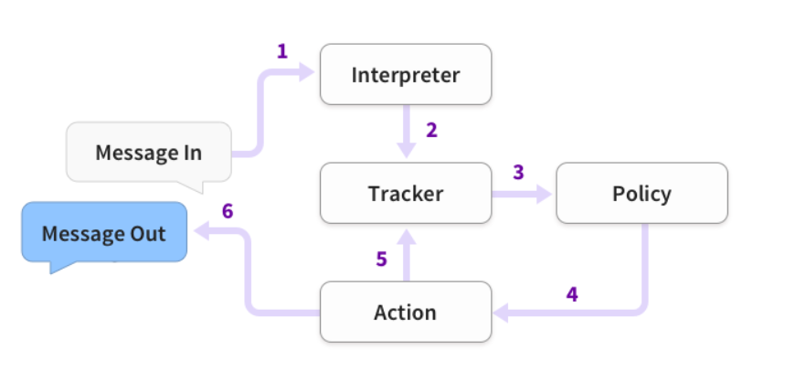
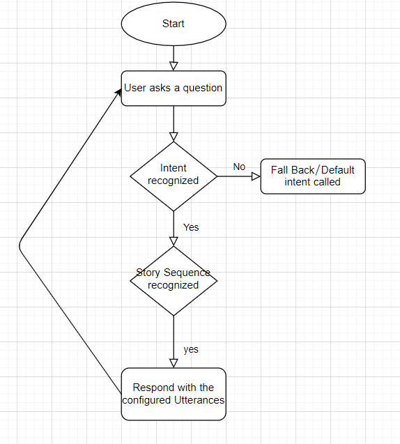

# second_home_chatbot

## Introduction
This chatbot is created using the Rasa X 
Rasa X is a tool for Conversation-Driven Development (CDD), the process of listening to your users and using those insights to improve your AI assistant.

## Tools and Technologies used
Other tools and Technologies used while developing this are Tensorflow, Natural Language Processing and API Integration.

## Uses
1. Customer Support
2. Frequently asked questions
3. Addressing grieveances
4. Appointment Bookings
5. Automation of routine Task
6. Address a query

## Applications:
This Chatbot can be delpoyed on your own website, Facebook Messenger, Telegram, Slack, Twilio, Google Hangouts Chat, Microsoft Box Framework, Cisco Webex Framework, Rocketchat, Mattermost and many other platforms.

## Prerequisites
1. Python Installed
2. Microsoft Build tools with visual C++ 14.0 installed
Link to download: https://visualstudio.microsoft.com/downloads/

## Architecture and Application flow
The Architecture of the chatbot is as follows

The Application-flow of chatbot is as follows

## How to run
To run the chatbot in local server:
1. Clone the repository to your desired path.
2. Open the parent folder as a a Pycharm proect.
3. Create a virtual environment for your project. (Conda Environment or Vitualenv Environment as per your choice)
4. Python and C++ build tools should be installed beforehand
5. open terminal and run the commands
  a. pip install rasa
  b. pip install spacy
  c. pip install rasa_x
  d. python -m spacy download en
  e. python -m spacy download en_core_web_md
  
6. After doing this type "rasa train" and press enter
7. then to test your chatbot type rasa shell and press enter
8. Test the chatbot, if you want some changes do them and repeat process 6 and 7
9. if the chatbot is working properly your chatbot is ready to be integrated with the app or website.
